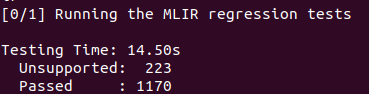

<!-- <style>
h1 {
    border-bottom: none
}
</style> -->

# <center> <font size=6>编译原理大作业</font>
## 实验环境：
* 操作系统（推荐）： Ubuntu 20.04
* 虚拟机软件（推荐）：VMware workstation pro
## 构建步骤（以Ubuntu为例）：
### 1. 前置工具： 
git, cmake, clang, lld, ninja
```
sudo apt install git
sudo apt install cmake
sudo apt-get install clang lld
sudo apt install ninja-build
```
### 2. 安装MLIR： 
```
git clone https://github.com/Jason048/llvm-project.git
mkdir llvm-project/build
cd llvm-project/build
cmake -G Ninja ../llvm \
   -DLLVM_ENABLE_PROJECTS=mlir \
   -DLLVM_BUILD_EXAMPLES=ON \
   -DLLVM_TARGETS_TO_BUILD="X86;NVPTX;AMDGPU" \
   -DCMAKE_BUILD_TYPE=Release \
   -DLLVM_ENABLE_ASSERTIONS=ON \
   -DCMAKE_C_COMPILER=clang -DCMAKE_CXX_COMPILER=clang++ -DLLVM_ENABLE_LLD=ON
```
执行完上述步骤后会有如下提示：


 
    
之后执行：
```
cmake --build . --target check-mlir
```
如果运行结果如下图所示，证明MLIR已经安装并成功编译：


 

### 3. 安装tiny_project： 
```
git clone https://github.com/Jason048/tiny_project.git
mkdir build  
cd build

# 将下面的三行命令在build目录下的terminal中执行
# 注意下面的LLVM_DIR和MLIR_DIR要改成自己llvm-project对应的路径
LLVM_DIR=/Path/to/llvm-project/build/lib/cmake/llvm \
MLIR_DIR=/Path/to/llvm-project/build/lib/cmake/mlir \
cmake -G Ninja ..
```
例如:

 
这里需要根据你llvm-project的下载地址设置好LLVM_DIR和MLIR_DIR的路径。
### 4. 基础部分的实现与验证：

**词法分析器**(/tiny_project/tiny/include/tiny/Lexer.h)：
    
在Lexer.h搜索"TODO"，可以看到需要补充的代码位置。
实现以下功能

1).  能够识别“return”、“def”和“var”三个关键字<br>
2).  按照如下要求识别变量名：<br>
&emsp;•  变量名以字母开头<br>
&emsp;• 变量名由字母、数字和下划线组成<br>
&emsp;• 变量名中有数字时，数字应该位于变量名末尾<br>
&emsp;例如：有效的变量名可以是 a123, b_4, placeholder 等。

**语法分析器**(/tiny_project/tiny/include/tiny/Parser.h)：
    
在Parser.h搜索"TODO"，可以看到需要补充的代码位置。
实现以下功能

1).  语法变量必须以“var”开头，后面为变量名及类型，最后为变量的初始化<br>
2).  语法分析器已支持以下两种初始化形式，以一个二维矩阵为例：<br>
&emsp;• var a = \[[1, 2, 3], [4, 5, 6]] <br>
&emsp;• var a<2,3> = [1, 2, 3, 4, 5, 6]<br>
需要同学们额外支持第三种新的形式：<br>
&emsp;• var a[2][3] = [1, 2, 3, 4, 5, 6]<br>

当你对词法分析器和语法分析器补充完毕后，可以运行以下指令来检查程序的正确性。

**词法分析器验证（test_1 - test_4）：**
    
以test_1为例：
build tiny并执行下面测试用例以验证词法分析器是否能够检测出错误的词法单元
```
cmake --build . --target tiny
cd ../
build/bin/tiny test/tiny/parser/test_1.tiny -emit=ast
```
如果执行结果如下图所示，表示词法分析器分析正确。


**语法分析器验证（test_5-test_6）：**
    
测试test_5: 验证语法分析器能否识别出三种声明及初始化方式，输出AST（-emit=ast）：
```
build/bin/tiny test/tiny/parser/test_5.tiny -emit=ast
```
测试test_6: 执行以下指令查看输入程序的运行结果（-emit=jit）：
```
build/bin/tiny test/tiny/parser/test_6.tiny -emit=jit
```
注： var a[2][3] = ... 为我们新增的声明及定义方式，在本次作业中对于此种形式，我们只要求语法分析器能识别这种表示，生成对应的合法AST即可。如果想要查看输入程序的运行结果，则需拓展Tiny dialect以支持此新增表示，感兴趣的同学可以自己尝试。

### 5. 进阶部分的实现与验证：
**代码优化**(/tiny_project/tiny/mlir/TinyCombine.cpp)：
    
在TinyCombine.cpp搜索"TODO"，可以看到需要补充的代码位置。
    
实现以下功能：
将tiny dialect的冗余转置代码优化pass补充完整。最终实现冗余代码的消除。

**代码优化验证（test_7）：**
    
对于test_7中的例子：
```
def transpose_transpose(x) {
  return transpose(transpose(x));
}

def main() {
  var a<2, 3> = [[1, 2, 3], [4, 5, 6]];
  var b = transpose_transpose(a);
  print(b);
}
```
执行以下指令，输出转换后的tiny dialect（即转换后的代码表示），
查看输出结果可判断是否成功消除冗余转置
```
build/bin/tiny test/tiny/parser/test_7.tiny -emit=mlir -opt
```
注释掉刚刚在TinyCombine.cpp中添加的代码，执行指令查看未优化的输出，对比优化前后输出的差异
```
build/bin/tiny test/tiny/parser/test_7.tiny -emit=mlir -opt
```


此外，同学们还可以利用不同指令，输出此测试用例在编译过程中出现的多种形式：

将.tiny文件转换为抽象语法树AST：
```
build/bin/tiny test/tiny/parser/test_7.tiny -emit=ast
```
或直接得到tiny程序的运行结果，是否进行消除冗余不会影响运行结果
```
build/bin/tiny test/tiny/parser/test_7.tiny -emit=jit
```
